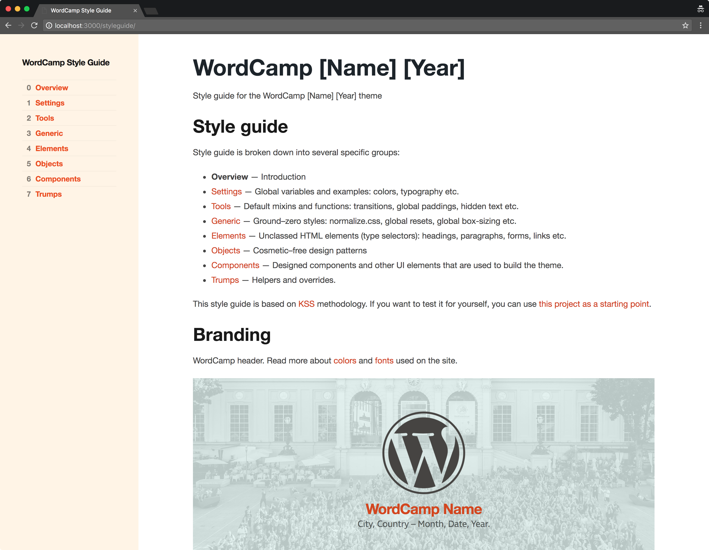
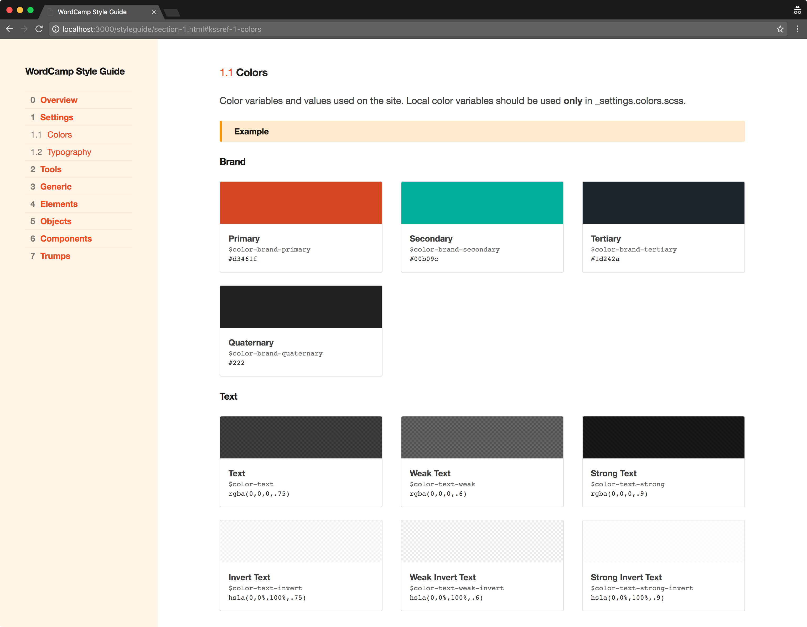
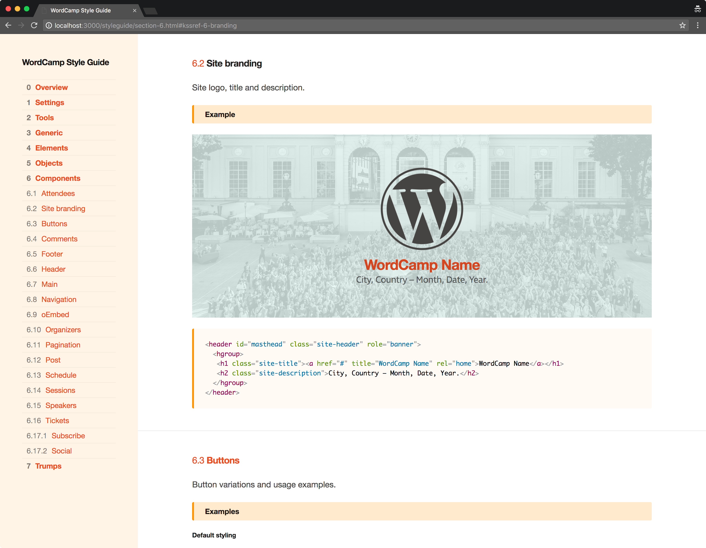

# WordCamp Style Guide

Read [the article about the style guide](https://2017.europe.wordcamp.org/2017/05/09/using-style-guides-for-modular-wordcamp-designs/) on WordCamp Europe blog. See the current version of the generated [style guide](https://lucijanblagonic.github.io/wordcamp-style-guide/styleguide/).

This blank style guide originated from the WordCamp Europe 2017 design team. Read the **article about the style guide** on the blog.

The main elements are based on the wordcamp-base-redux-2

---

## Getting Started

Install [node.js](http://nodejs.org).

	npm install gulp
	npm install

You are done.

### `gulp`

Use `gulp` for on–the–fly updates of your code (templates, js, css) and style guide.

### `gulp build`

This will create a `build` directory for project assets and a `styleguide` directory from your KSS documentation in CSS **without browser-sync live preview**.

## Directory Structure

Feel free to modify everything in the `source` directory and keep in mind that `styleguide` and `build` directories are rebuilt with each `gulp build` command.

	gulpfile.js
	package.json
	readme.md
	source/
	├── assets/ [images, stylesheets]
	├── styleguide-template/ [modified KSS template for generating style guides]
	├── kss-config.json [style guide configuration]
	└── styleguide.md [description of the project and the style guide]

	build/ [generated via gulp]
	styleguide/ [generated via gulp]

## Interesting Bits

* Uses [Bourbon](bourbon.io), a lightweight Sass Tool Set
* Uses [Modular scale](https://github.com/modularscale/modularscale-sass) for typography
* Uses [Susy](susy.oddbird.net) for grids
* CSS architecture based on ITCSS (Inverted Triangle CSS) by [Harry Roberts](http://csswizardry.com) [Article](http://www.creativebloq.com/web-design/manage-large-css-projects-itcss-101517528)

## Additional Resources

More information about [style guides](http://www.styleguides.io/).

Articles and tools to start documenting interfaces and build style guides:

* [Documenting interfaces](http://polarnorth.org/blog/documenting-interfaces/)
* [Interface inventory](https://github.com/lucijanblagonic/interface-inventory/)
* [Moving the design process to the browser](http://polarnorth.org/blog/moving-the-design-process-to-the-browser/)

---

## Other Style Guides

* [WordCamp Europe 2017](https://lucijanblagonic.github.io/wceu-2017/styleguide)
